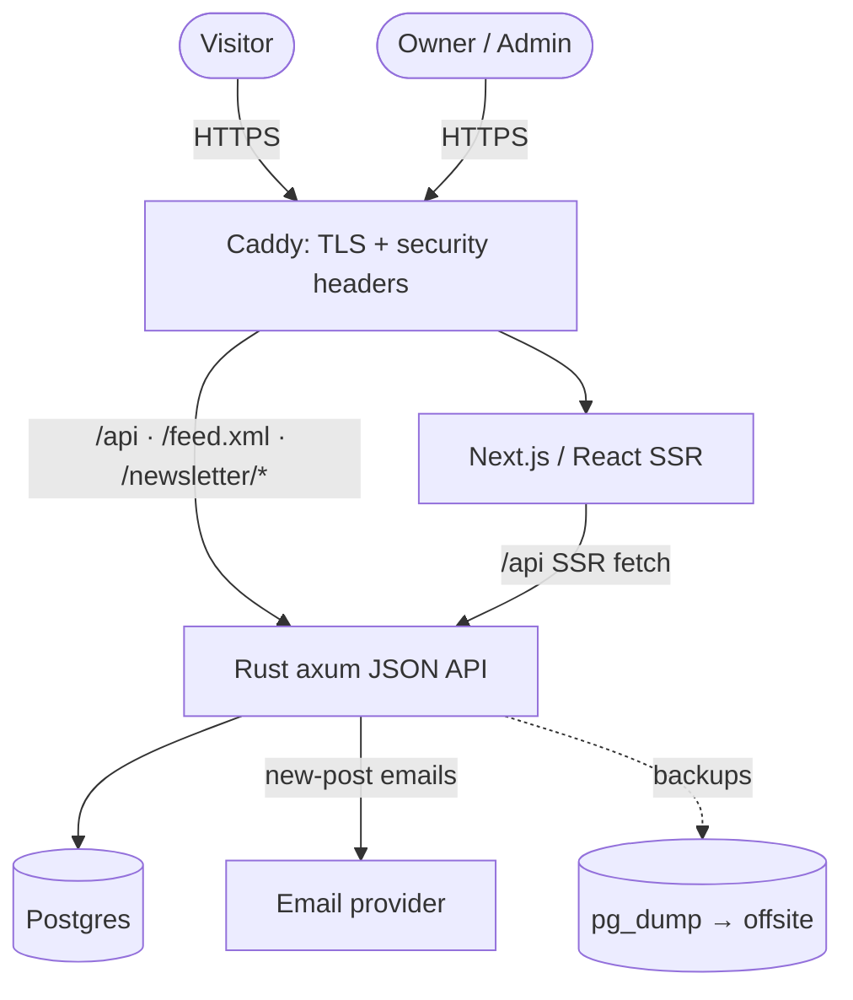
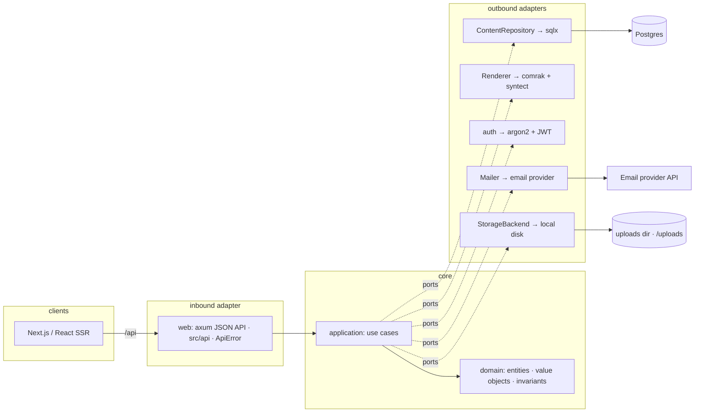
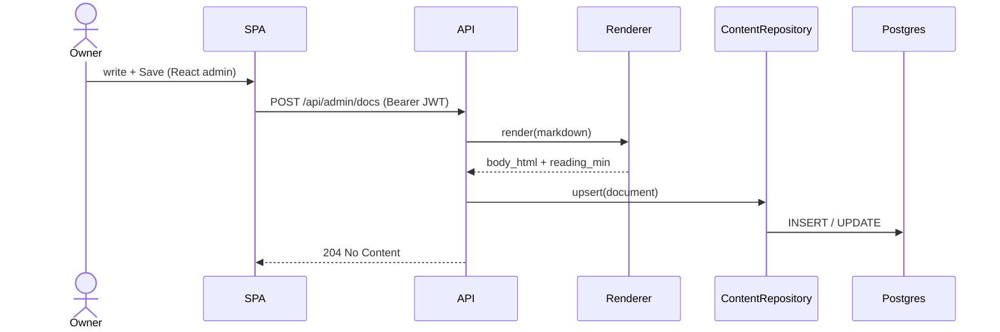
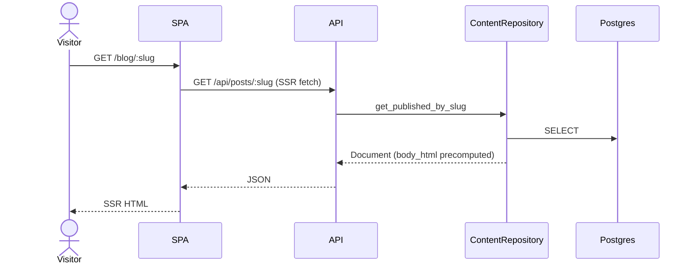
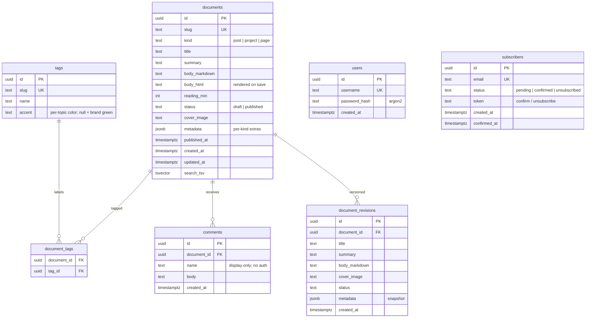

# Architecture — genuine.dev

The **living** architecture reference: decisions + diagrams, kept in sync with the
code at all times. Diagrams are [Mermaid](https://mermaid.js.org) (text-based, so
they're version-controlled and easy to keep current). **Last updated: 2026-06-27.**

> **Rule:** any change that affects structure, boundaries, ports, or the database
> schema updates this file in the *same* change — the diagram and the decision log
> are never allowed to drift from the code.

Scope below = **MVP** (Phases 0–3). Post-MVP additions (Phases 4–12) extend this
without changing its shape — new adapters behind existing ports.

---

## 1. System context (deployment)

**Split stack (ADR-013).** Single VPS, docker-compose: Caddy terminates TLS and
routes `/api`, `/feed.xml`, `/sitemap.xml`, `/newsletter/*`, `/healthz` to the
**Rust axum JSON API** (`backend/`), everything else to the **Next.js frontend**
(`frontend/`). Frontend SSR fetches the API server-side (`API_INTERNAL_URL`); the
browser calls it same-origin via Caddy. JWT auth. Postgres is the source of truth.

> The hexagonal/ER/flow sections below describe the **backend** (`backend/`); its
> web adapter is the JSON API (`src/api/`, `ApiError`). The frontend is the separate
> Next.js app.

---

## 2. Internal architecture (hexagonal / ports & adapters)

Dependencies point inward. `domain` is pure; everything external is an adapter
behind a port (trait).

The **web adapter is the axum JSON API** (`src/api/`); handlers stay thin and
return `ApiError` (which implements `IntoResponse` → status + JSON). The Next.js/
React frontend (separate app) consumes it — SSR fetches server-side, the browser
calls it same-origin via Caddy.

**Ports (traits) defined at known seams** — one impl now, a planned second later:
`ContentRepository`, `Renderer`, `AuthProvider`, `Mailer`, `StorageBackend`
(local disk → object storage later) (+ post-MVP: `SearchBackend`, `ThemeProvider`).
`domain` must not import `infra`.

---

## 3. Key request flows

**Publish/edit a post (owner, admin):**

**Read a post (visitor, public):**

Rendering happens **on save**, not on read — the public path just serves stored
`body_html`.

---

## 4. Data model (ER — MVP)

`users` is the single-owner admin (Phase 2.5). `subscribers` powers the MVP
newsletter (double opt-in + email-on-publish, Phase 2.7). `comments` are
unauthenticated, flat (no threading), and cascade-deleted with their document
(Phase 4, migration `0004`). `document_revisions` snapshot the document on every
admin save (deduped, newest-50 retained) for the editor's version history
(Phase 5, migration `0006`); they cascade with the document. Sessions are handled
by `tower-sessions` (its own store). Further post-MVP tables (`media`,
`link_previews`, `themes`, …) attach without reshaping the above — see ROADMAP §4/§11.

---

## 5. Decision log (ADRs)

Newest first. Status: ✅ accepted · ⏳ proposed · ⛔ superseded.

| # | Date | Decision | Status | Rationale |
|---|---|---|---|---|
| 017 | 2026-06-29 | **Document revision history** — snapshot on every save (`document_revisions`), deduped + newest-50 retained; **restore is client-side** (load snapshot into editor → user saves) | ✅ | Durable, diffable version history beyond local autosave. Snapshot-on-save keeps the write path simple; non-destructive restore means a restore is just another edit (auto-snapshotted). Linked by stable `documents.id`. |
| 016 | 2026-06-28 | **TipTap WYSIWYG editor serializing to Markdown** + **`StorageBackend` port** (local-disk image uploads via `POST /api/admin/upload`, served at `/uploads/*`) | ✅ | Keeps `body_markdown` + the `:::`/syntect render pipeline as source of truth; `:::` directives are custom editor nodes storing raw source losslessly (structured forms layered on top). Storage is a port so object storage can swap in later (rule of three deferred — one impl now). |
| 015 | 2026-06-28 | **Self-hosted, DB-backed comments** (`comments` table + `/api/posts/{slug}/comments`), not Giscus | ✅ | Keeps the CMS fully self-contained — no GitHub dependency. Flat + unauthenticated for now; moderation/threading are additive. |
| 014 | 2026-06-28 | **`:::` block directives + attributed code fences rendered server-side** (syntect line numbers/highlight); `featured`/`series` live in `documents.metadata` | ✅ | Reuses NotiQ's component library across posts/projects (ADR-007) with zero schema churn; directive HTML is themed via CSS variables. Interactivity is attached client-side by `DocInteractive`. |
| 013 | 2026-06-28 | **Split architecture: Rust axum JSON API (`backend/`) + React/Next.js/TS SPA (`frontend/`)**, JWT auth. ⛔ supersedes ADR-009 + ADR-012 | ✅ | Leptos is pre-1.0 (breaking churn); React+TS gives stability + huge ecosystem (incl. TipTap for WYSIWYG) + clean front/back separation. Rust domain/infra/repo/render/auth/mailer/subscribers/migrations all reused behind the API. |
| 012 | 2026-06-28 | UI stays Leptos + SCSS; no React/Tailwind/UI-kit | ⛔ superseded by 013 | Reversed — owner chose React+TS (Leptos pre-1.0 stability concern). |
| 011 | 2026-06-28 | sqlx **runtime-checked** queries (`query`/`query_as`), not compile-time `query!` macros | ✅ | Compile-time macros couple every build to a live DB and slow iteration. Correctness via integration tests instead. |
| 010 | 2026-06-27 | **Newsletter in the MVP** — subscribers + email-on-publish (double opt-in) via a transactional email provider | ✅ | Owner wants subscribers notified from launch. Send via provider API (deliverability); send off the publish path. |
| 009 | 2026-06-27 | Frontend = full Leptos (SSR + hydration) on axum; `cargo-leptos` build | ⛔ superseded by 013 | Was: one cohesive Rust full-stack. Reversed — Leptos pre-1.0 stability; moved to React/Next + Rust JSON API. |
| 008 | 2026-06-27 | Responsive, **mobile-first** baseline; first-class mobile reading experience | ✅ | A blog is read on phones; readability + responsive layout are MVP requirements, not polish. |
| 007 | 2026-06-27 | Project case studies composed from a reusable block/directive library (not bespoke per-project HTML) | ✅ | Any new project reuses NotiQ's components; the same directives also enrich posts. |
| 006 | 2026-06-27 | CSS-variable theming: light/dark + presets + per-topic accents; NotiQ green default | ✅ | A theme is just a token map; cheap + extensible. Topic color = page identity. |
| 005 | 2026-06-27 | MVP includes own-built minimal auth + browser editor (Phase 2.5) | ✅ | Author posts in-browser at launch; auth is the best full-stack learning. |
| 004 | 2026-06-27 | Hosting: single VPS + Caddy + docker-compose + GitHub Actions CD | ✅ | Full control, cheap, good ops/infosec practice. No AWS needed. |
| 003 | 2026-06-27 | Modular monolith, hexagonal architecture (not microservices) | ✅ | One developer, one deploy; microservices are the *NotiQ* showcase, not this app. |
| 002 | 2026-06-27 | DB-backed CMS; browser-admin authoring; **Postgres is sole source of truth** | ✅ | Dropped git/file markdown ingest (user). Simpler; backups + revision history replace git history. ⛔ supersedes the earlier hybrid-markdown idea. |
| 001 | 2026-06-27 | Frontend = `maud` (SSR) + HTMX; no Leptos in MVP | ⛔ superseded by 009 | Was: best SEO/simplicity for a content site. Reversed — owner chose full Leptos for one cohesive Rust stack. |

When a decision changes, add a new row (don't rewrite history) and mark the old one
⛔ superseded.
